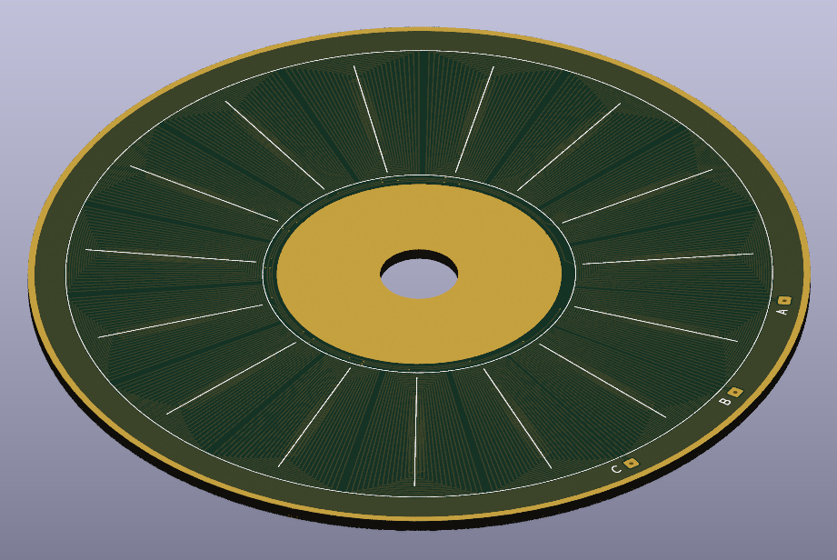

# KiMotor  

KiMotor is a [KiCad EDA](https://www.kicad.org/) plugin that automates the design of parametric PCB motors.




## Installation

### Manual, with Git clone

This is the preferred way of installing the plugin. Cloning the repo allows you to manually pull in updates later on, as they become available

Depending on your platform, you have to make sure the plugin is placed in the folder where KiCad expects it to be (see the plugins search paths [KiCad documentation](https://dev-docs.kicad.org/en/apis-and-binding/pcbnew/)):

```bash
# Linux (KiCad from Ubuntu PPA)
# TODO
# Linux (KiCad 7 from FlatPak)
cd <HOME>/.var/app/org.kicad.KiCad/data/kicad/7.0/3rdparty/plugins
# Windows
cd C:\Users\<USERNAME>\Documents\KiCad\7.0\3rdparty\plugins

git clone https://github.com/cooked/kimotor.git
```

### Manual, via repo archive

Similar to the previous method but, instead of cloning the repo, download it as a zip archive and unpack it in the proper folder (described above).


### Automated, via package manager

While a Kimotor version do exist in the official KiCad plugin repository, it has since 
fallen behind the development and is not recommended. 
Stick to one ofthe manual installation methods listed above, until next official release.

## What works and What does not

TODO

